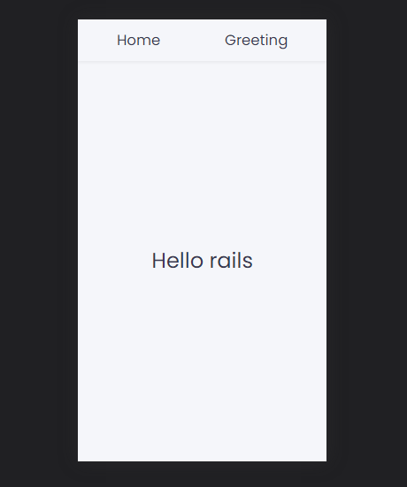
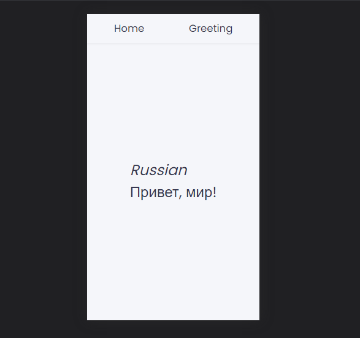

# Hello-rails

> A react app that displays a random greeting message. It uses rails restful API to retrieve data..

<table>
  <tr>
    <th>Home</th>
    <th>Random-Greeting</th>
  </tr>
  <tr>
    <td></td>
    <td></td>
  </tr>
</table>

## Counterpart app link

- [backend-app](../../../hello-rails-backend)


## Built With

- HTML5
- CSS3
- Redux
- React
- JavaScript


## Getting Started

To get a copy of this project running on your local computer, do the followings:

### Prerequisites

- Must have a working computer
- A Web-Browser installed (Chrome - Recommended)

### Setup

- Install __VSCode__ ([link](https://code.visualstudio.com/download))
- Clone this project repository on your local computer. ([link](../../))
- Open the project directory with _VSCode_

### Install

Open __Terminal/Shell__ inside your __VSCode__ and run
  ```
    npm install --force
  ```

### Run Tests

- For __stylelint__ tests, run
  ```
    npm run stylelint
  ```
- For __eslint__ tests, run
  ```
    npm run eslint
  ```
- For __react__ tests, run
  ```
    npm test
  ```

### Run Tests Fix

- For __stylelint__ tests, run
  ```
    npm run stylelint-fix
  ```
- For __eslint__ tests, run
  ```
    npm run eslint-fix
  ```


## Authors

👤 **Steve**

- GitHub: [@sntakirutimana72](../../../)

## 🤝 Contributing

Contributions, issues, and feature requests are welcome!

Feel free to check the [issues page](../../issues/).

## Show your support

Give a ⭐️ if you like this project!

## Acknowledgments

- Fellow Micronauts

## 📝 License

This project is [MIT](./LICENSE) licensed.
